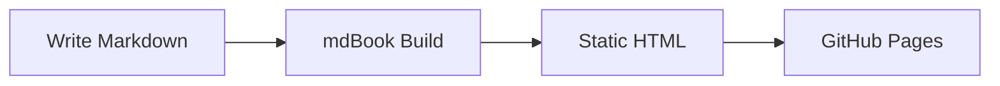
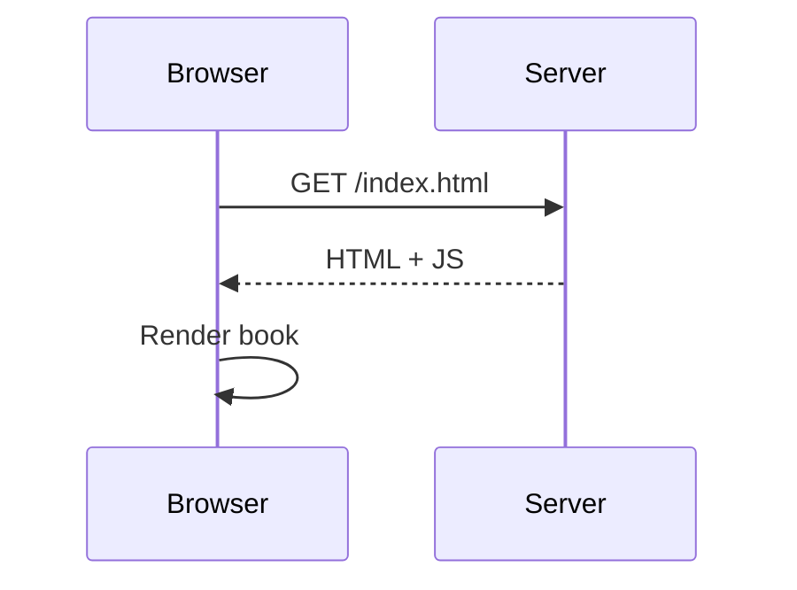
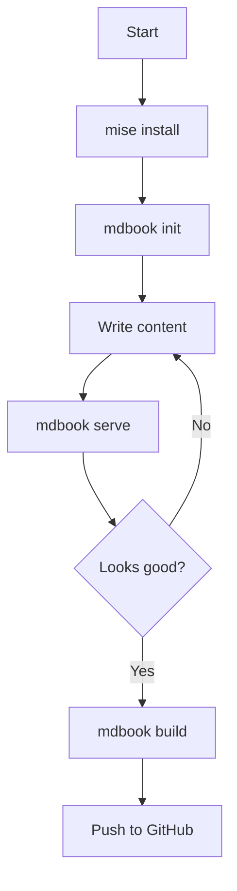

# Mermaid Diagrams

[mdbook-mermaid](https://github.com/badboy/mdbook-mermaid) integrates
[Mermaid.js](https://mermaid.js.org/) so you can write diagrams directly in
fenced code blocks.

## Installation

Add the plugin to `mise.toml` alongside mdBook:

```toml
[tools]
"aqua:rust-lang/mdBook" = "0.5.2"
"ubi:badboy/mdbook-mermaid" = "0.17.0"
```

Install:

```sh
mise install
```

Then run the one-time setup to copy the JavaScript files and update `book.toml`:

```sh
mdbook-mermaid install path/to/your/book
```

This adds `mermaid.min.js` and `mermaid-init.js` to your project root and
configures the preprocessor in `book.toml`:

```toml
[output.html]
additional-js = ["mermaid.min.js", "mermaid-init.js"]

[preprocessor.mermaid]
command = "mdbook-mermaid"
```

## Usage

Wrap your diagram code in a fenced block tagged `mermaid`:

````md

````

Renders as:


## More examples

### Sequence diagram



### Flowchart



Mermaid supports many diagram types: flowcharts, sequence diagrams, Gantt charts,
class diagrams, state diagrams, ER diagrams, pie charts, and more. See the
[Mermaid documentation](https://mermaid.js.org/intro/) for the full list.
